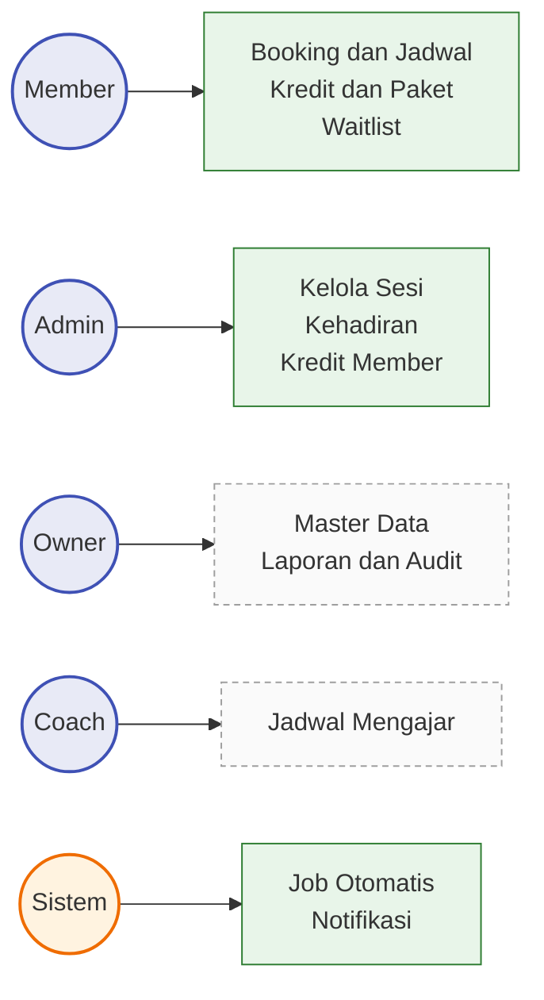
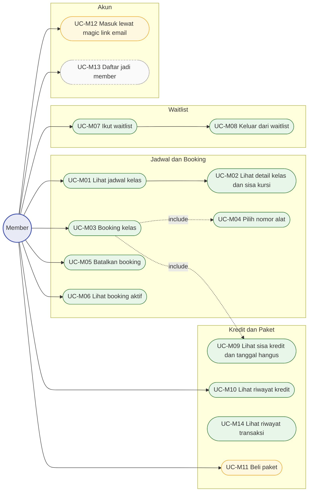
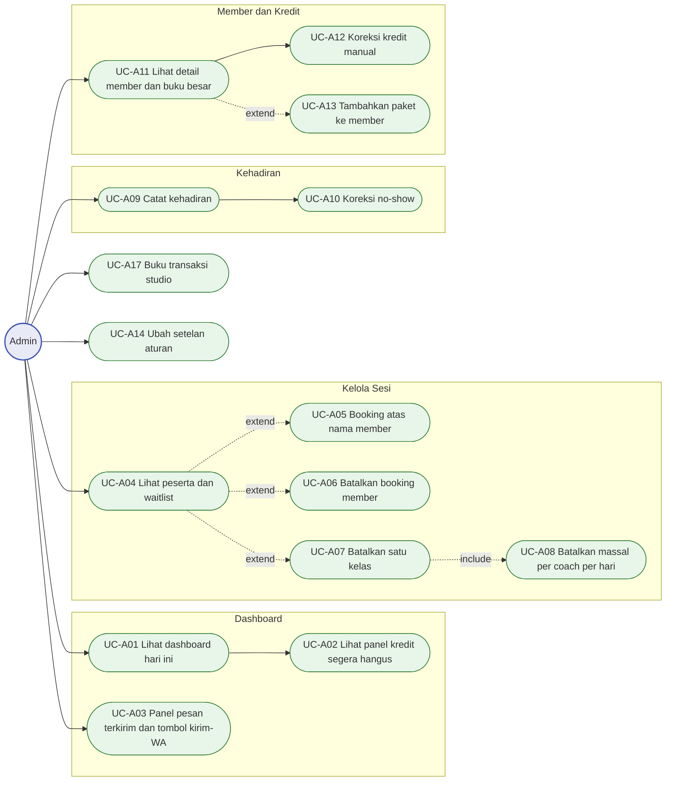
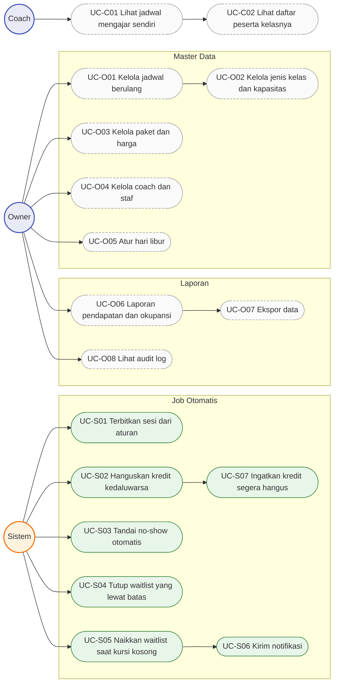
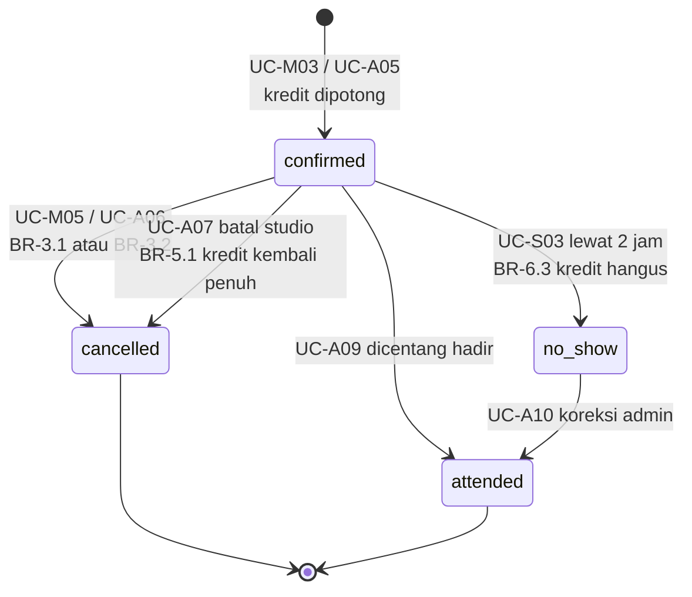
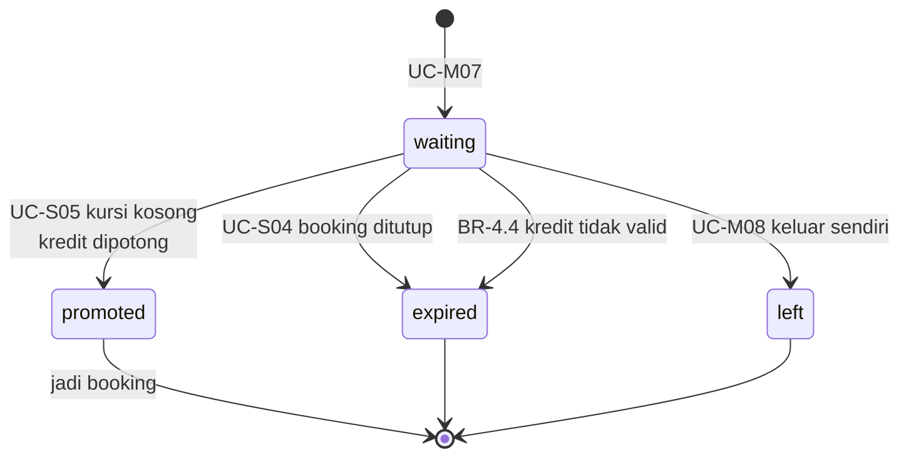
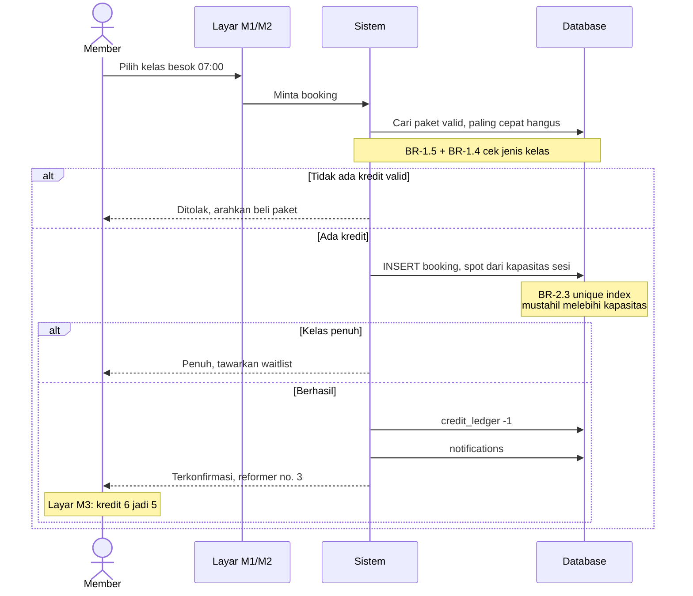
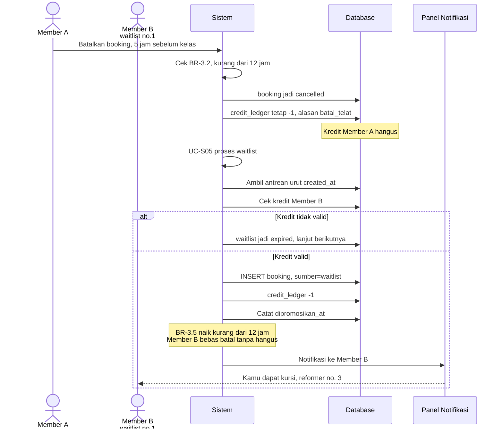
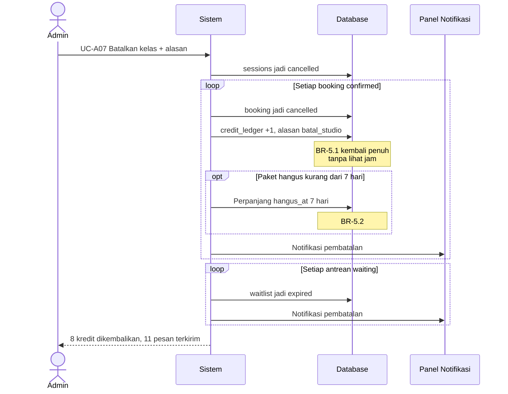

# Peta Use Case — Sistem Booking Studio Pilates

> **Status:** Draft · **Terakhir diperbarui:** 2026-09-21
> Pendamping [02-rules.md](02-rules.md), [05-data-model.md](05-data-model.md), [04-flows.md](04-flows.md).
> Setiap use case punya ID tetap (`UC-xNN`) dan merujuk aturan `BR-x.y` yang dijalankannya.
>
> Legenda: **✅** dibangun di demo · **◐** dipalsukan di demo · **⬜** hanya versi real

---

## 1. Peta aktor

Empat aktor manusia + satu aktor sistem. **Demo hanya punya dua peran: Member dan Admin.**
Owner dan Coach baru dipisah di versi real.

---

## 2. Use case Member

| ID | Use case | Aturan | Demo |
|---|---|---|:--:|
| UC-M01 | Lihat jadwal kelas — kalender mingguan di laptop, daftar per hari di HP. **Tidak butuh akun**: `/jadwal` melayani pengunjung dengan jadwal yang sama tanpa tombol booking (DS-45) | BR-2.1 | ✅ |
| UC-M02 | Lihat detail kelas dan sisa kursi | BR-7.2 | ✅ |
| UC-M03 | Booking kelas | BR-2.1–2.7 | ✅ |
| UC-M04 | Pilih nomor alat *— include dari M03* | BR-2.6 | ✅ |
| UC-M05 | Batalkan booking | BR-3.1–3.5 | ✅ |
| UC-M06 | Lihat booking aktif | — | ✅ |
| UC-M07 | Ikut waitlist saat kelas penuh | BR-4.1, 4.5 | ✅ |
| UC-M08 | Keluar dari waitlist | BR-4.7 | ✅ |
| UC-M09 | Lihat sisa kredit + tanggal hangus + hitung mundur | BR-1.2, 1.7 | ✅ |
| UC-M10 | Lihat riwayat kredit | BR-1.7 | ✅ |
| UC-M11 | Beli paket dan bayar | BR-8.1–8.2 | ◐ |
| UC-M12 | Masuk ke akun lewat magic link email | BR-9.1 | ◐ |
| UC-M13 | Daftar jadi member baru | — | ⬜ |
| UC-M14 | Riwayat transaksi sendiri — tiap paket yang dibeli beserta nasib kreditnya: jadi kelas, kembali, atau hangus. Satu transaksi bisa dibuka sampai buku besarnya | BR-1.7, 8.5 | ✅ |

---

## 3. Use case Admin

| ID | Use case | Aturan | Demo |
|---|---|---|:--:|
| UC-A01 | Dashboard hari ini: sesi, okupansi, ringkasan · **antrean menunggu kursi** · **kelas yang belum diabsen** | BR-4.2, 6.2 | ✅ |
| UC-A02 | **Panel kredit segera hangus** — daftar member yang harus di-chat | BR-1.2, 1.6 | ✅ |
| UC-A03 | Panel pesan terkirim + **tombol kirim-WA** untuk notifikasi mendesak | BR-4.3, 5.3 | ✅ |
| UC-A04 | Lihat peserta + waitlist satu sesi | BR-4.2 | ✅ |
| UC-A05 | Booking atas nama member | BR-9.2 | ✅ |
| UC-A06 | Batalkan booking milik member | BR-3.1–3.2 | ✅ |
| UC-A07 | Batalkan satu kelas + isi alasan | BR-5.1–5.6 | ✅ |
| UC-A08 | Batalkan massal: semua kelas satu coach dalam satu hari | BR-5.4 | ✅ |
| UC-A09 | Centang kehadiran | BR-6.1 | ✅ |
| UC-A10 | Koreksi no-show + isi alasan | BR-6.4 | ✅ |
| UC-A11 | Detail member + buku besar lengkap | BR-1.7 | ✅ |
| UC-A12 | Koreksi kredit manual + wajib alasan | BR-1.8 | ✅ |
| UC-A13 | Tambahkan paket ke member *— pengganti pembayaran di demo* | BR-8.1 | ✅ |
| UC-A14 | Ubah setelan aturan: batas batal, jendela booking, maks waitlist | 02-rules.md bagian 3 | ✅ |
| UC-A15 | Kalender mingguan seluruh studio, bisa geser ke minggu mana pun | BR-7.1 | ✅ |
| UC-A16 | Direktori member: cari, lihat sisa kredit dan kapan terakhir hadir | BR-1.7 | ✅ |
| UC-A17 | Buku transaksi studio: tiap paket yang berpindah ke member + kredit yang dipindah tangan (koreksi manual, perpanjangan karena kelas batal). **Tanpa penjumlahan uang** | BR-1.7, 1.8, 9.1 | ✅ |

---

## 4. Use case Sistem, Owner, dan Coach

| ID | Use case | Pemicu | Aturan | Demo |
|---|---|---|---|:--:|
| UC-S01 | Terbitkan sesi dari aturan berulang | **Tombol di A7** | BR-7.1 | ✅ |
| UC-S02 | Hanguskan kredit kedaluwarsa | Harian | BR-1.6 | ✅ |
| UC-S03 | Tandai no-show otomatis | Tiap jam | BR-6.2 | ✅ |
| UC-S04 | Tutup waitlist yang lewat batas booking | Tiap jam | BR-4.6 | ✅ |
| UC-S05 | **Naikkan waitlist saat ada kursi kosong** | Saat ada pembatalan | BR-4.3–4.4 | ✅ |
| UC-S06 | Kirim notifikasi | Saat peristiwa | BR-4.3, 5.3 | ✅ |
| UC-S07 | Ingatkan member kredit segera hangus | Harian | — | ✅ |
| UC-O01 | Kelola jadwal berulang | — | BR-7.1, 7.3 | ✅ |
| UC-O02 | Kelola jenis kelas & kapasitas | — | BR-7.2 | ◐ |
| UC-O03 | Kelola paket & harga | — | BR-1.4 | ✅ |
| UC-O04 | Kelola coach & staf | — | BR-9.3 | ◐ |
| UC-O05 | Atur hari libur / blackout | — | BR-7.4 | ⬜ |
| UC-O06 | Laporan pendapatan & okupansi · **omzet bulan ini dan nilai kredit menggantung di dashboard** | — | BR-9.3 | ✅ |
| UC-O07 | Ekspor data | — | — | ⬜ |
| UC-O08 | Lihat audit log | — | BR-9.5 | ⬜ |
| UC-O09 | Angka uang di buku transaksi: omzet periode, rata-rata per transaksi, nilai kredit yang hangus | — | BR-9.3 | ✅ |
| UC-C01 | Lihat jadwal mengajar sendiri | — | BR-9.4 | ✅ |
| UC-C02 | Lihat daftar peserta kelasnya | — | BR-9.4 | ✅ |
| UC-C03 | Lihat kredit yang terpakai di kelas yang diajarnya — kursi dan kredit, tanpa satu pun angka rupiah | — | BR-9.3, 9.4 | ✅ |

**UC-S05 adalah use case paling bernilai di seluruh sistem.** Itu yang mengubah
kursi kosong jadi uang, dan itu inti skenario B di presentasi.

---

## 5. Status — siklus hidup

### Booking

Baris `cancelled` **tidak pernah dihapus** — tetap jadi riwayat dan jejak audit.

### Antrean waitlist

---

## 6. Alur kritis — dua skenario presentasi

### Skenario A · Booking memotong kredit

### Skenario B · Batal telat dan waitlist naik otomatis

### Skenario B lanjutan · Coach sakit, batalkan satu kelas

---

## 7. Rekap cakupan

| Kelompok | Total UC | Demo ✅ | Palsu ◐ | Real ⬜ |
|---|:--:|:--:|:--:|:--:|
| Member | 14 | 11 | 2 | 1 |
| Admin | 17 | 17 | — | — |
| Sistem | 7 | 7 | — | — |
| Owner | 9 | 4 | 2 | 3 |
| Coach | 3 | 3 | — | — |
| **Total** | **50** | **42** | **4** | **4** |

Demo menjalankan **42 dari 50 use case secara nyata** — 84%. Yang tersisa hampir
seluruhnya modul pengelolaan master data dan laporan, bukan logika bisnis baru.
