# Alur Proses — Sistem Booking Studio Pilates

> **Status:** Draft · **Terakhir diperbarui:** 2026-09-21
> Pendamping [02-rules.md](02-rules.md), [05-data-model.md](05-data-model.md), [03-use-cases.md](03-use-cases.md).
>
> Dokumen ini memetakan **percabangan keputusan** — apa yang dicek, urutannya, dan
> apa yang terjadi di tiap cabang. Setiap alur merujuk `BR-x.y` dan `UC-xNN`.
>
> Legenda warna: 🟩 sukses · 🟥 ditolak · 🟨 keputusan · ⬜ proses

---

## 0. Peta alur

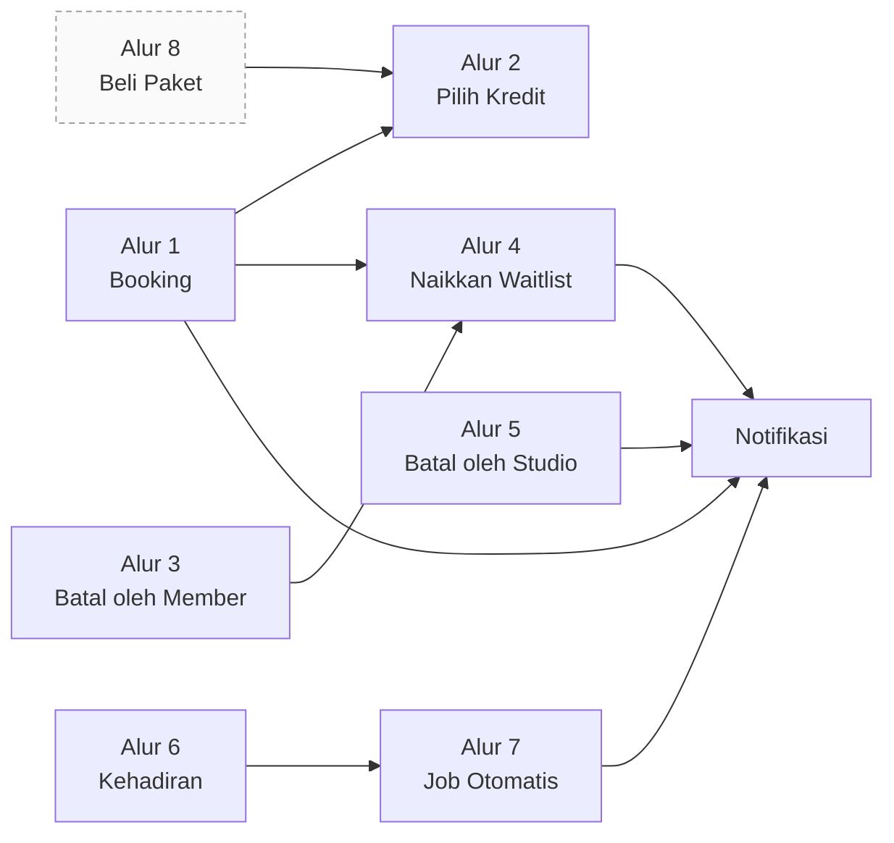

**Alur 4 adalah simpul terpenting** — dua jalur berbeda bermuara ke sana
(pembatalan member dan kursi kosong), dan dari sanalah uang diselamatkan.

---

## 1. Booking kelas — `UC-M03` / `UC-A05`

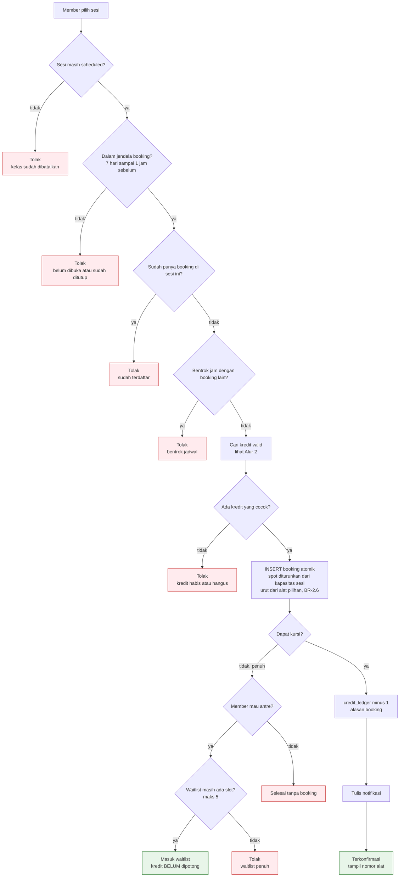

**Aturan:** BR-2.1 → BR-2.7, BR-4.1, BR-4.5

Urutan pengecekan sengaja begini: yang **paling murah dan paling sering gagal** dicek
duluan. Pengecekan kapasitas paling akhir karena itu satu-satunya yang menulis ke database.

### Pesan penolakan

| Kode | Kondisi | Teks untuk member |
|---|---|---|
| X1 | Sesi dibatalkan | "Kelas ini sudah dibatalkan." |
| X2 | Di luar jendela | "Booking dibuka 7 hari sebelum kelas dan ditutup 1 jam sebelum mulai." |
| X3 | Sudah terdaftar | "Kamu sudah terdaftar di kelas ini." |
| X4 | Bentrok | "Kamu sudah punya kelas lain di jam yang sama." |
| X5 | Tidak punya kredit hidup sama sekali | "Kredit kamu habis atau sudah lewat masa berlaku." |
| X6 | Waitlist penuh | "Daftar tunggu sudah penuh. Coba kelas lain." |
| X7 | Punya kredit hidup, tapi tidak untuk jenis kelas ini (BR-1.4) | "Paket kamu tidak berlaku untuk jenis kelas ini." |

X5 dan X7 keluar dari cabang yang sama — `pilihPaket()` mengembalikan `null` — tapi
jalan keluarnya berlawanan: X5 isi ulang, X7 beli paket yang mencakup kelas itu.
Menyamakannya membuat member berkredit 3 yang membuka kelas Mat dibilang kreditnya
habis, lalu menghubungi admin untuk menanyakan kredit yang jelas-jelas ada — chat yang
persis mau dihapus sistem ini. Yang membedakan keduanya adalah adanya paket yang
`hangus_at`-nya belum lewat **dan** sisanya di atas nol.

---

## 2. Pilih kredit mana yang dipakai — sub-alur

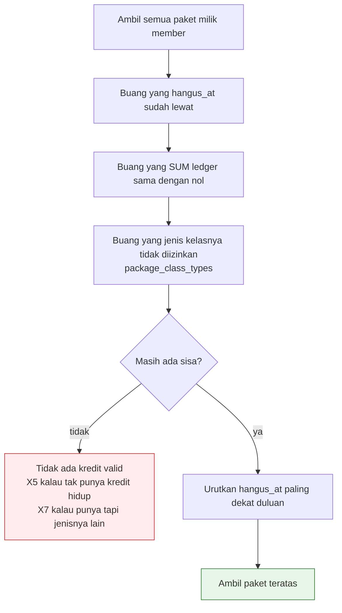

**Aturan:** BR-1.4, BR-1.5, BR-1.7

Langkah D yang sering dilupakan: kredit paket Mat **tidak boleh** dipakai di kelas
Reformer. Tanpa ini semua orang beli paket termurah lalu ikut kelas termahal.

Langkah G juga wajib: kalau member punya dua paket, yang **paling cepat hangus**
harus dipakai duluan. Kalau salah urutan, member dirugikan dan pasti protes.

---

## 3. Pembatalan oleh member — `UC-M05` / `UC-A06`

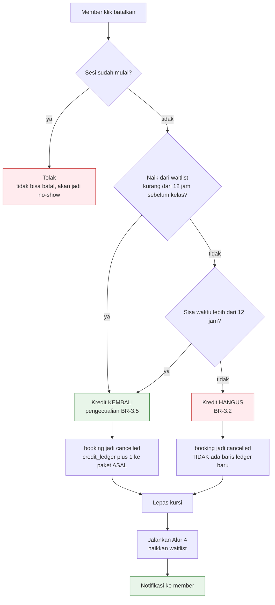

**Aturan:** BR-3.1 → BR-3.5

Dua hal yang gampang salah:

1. **Batal telat tidak menulis baris ledger apa pun.** Kredit sudah dipotong saat
   booking; "hangus" berarti potongan itu dibiarkan. Jangan menulis `−1` lagi.
2. **Kredit kembali ke paket asal**, dengan `hangus_at` yang tidak berubah. Kalau
   dibuatkan kredit baru, member bisa booking–batal berulang untuk memperpanjang masa berlaku.

---

## 4. Naikkan waitlist — `UC-S05` ⭐

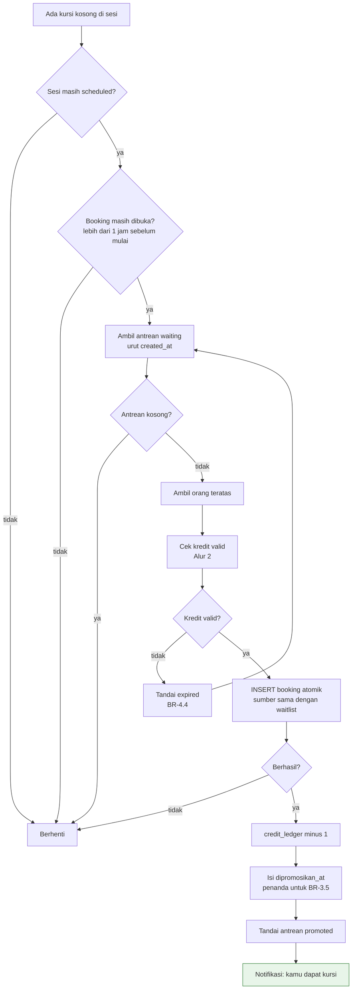

**Aturan:** BR-4.2 → BR-4.4, BR-3.5

Perhatikan **loop `I --> D`**: kalau orang teratas kreditnya tidak valid, dia dilewati
dan antrean lanjut ke orang berikutnya — bukan berhenti. Ini yang bikin kursi tetap terisi.

`dipromosikan_at` wajib diisi. Tanpa itu, BR-3.5 tidak bisa dihitung dan orang yang
baru dapat kursi 3 jam sebelum kelas ikut kena aturan hangus — tidak adil, dan owner
akan mendengar keluhannya.

---

## 5. Pembatalan oleh studio — `UC-A07` / `UC-A08`

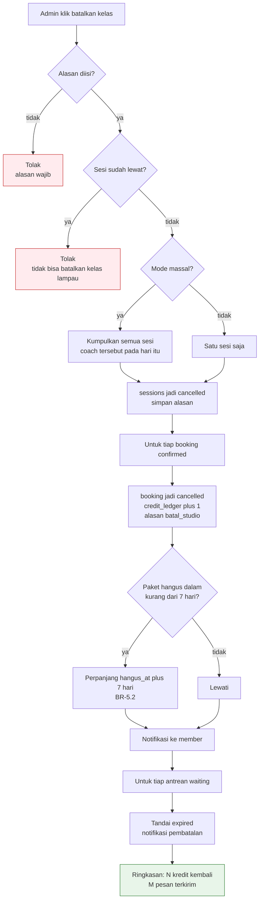

**Aturan:** BR-5.1 → BR-5.6

Kredit kembali **penuh tanpa melihat jam** — aturan batas 12 jam tidak berlaku di sini.
Kesalahan studio bukan kesalahan member.

Layar akhir harus menampilkan ringkasan berupa angka. Itu yang ditunjuk saat presentasi:
*"8 kredit kembali, 11 pesan terkirim, satu klik."*

---

## 6. Kehadiran — `UC-A09` / `UC-A10`

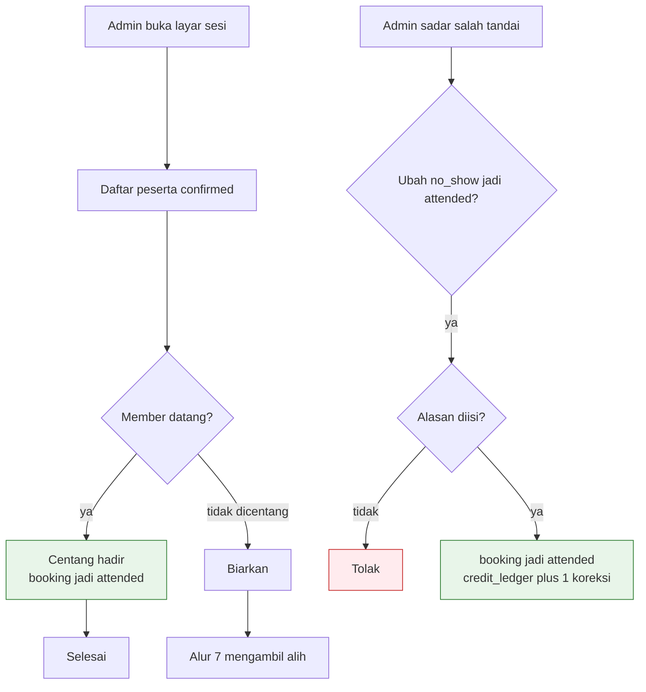

**Aturan:** BR-6.1, BR-6.3, BR-6.4

Kredit **tidak** dipotong lagi saat hadir — sudah dipotong waktu booking.
Kehadiran hanya mengubah status, tidak menyentuh ledger. Yang menyentuh ledger
hanya koreksi admin.

---

## 7. Job otomatis

### 7.1 No-show otomatis — tiap jam · `UC-S03`

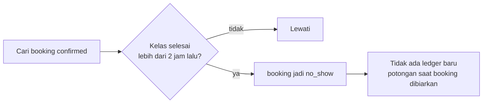

### 7.2 Hanguskan kredit — harian · `UC-S02`

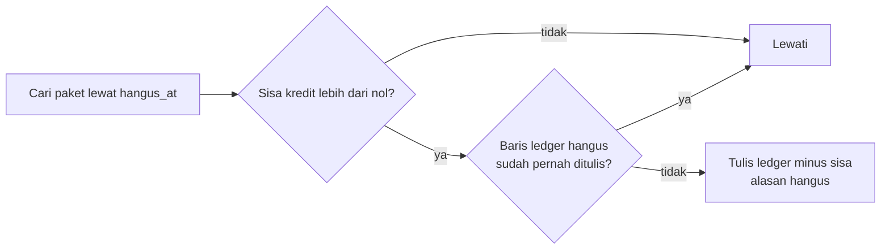

Pengecekan D yang membuat job ini **idempoten** saat dijalankan berurutan. Kalau
dua jalan bertumpang tindih, keduanya bisa membaca "belum" bersamaan — karena itu
jaring pengaman sesungguhnya ada di database: partial unique index
`credit_ledger_hangus_key` (05-data-model.md bagian 4). Sama persis dengan alasan
BR-2.3 tidak boleh memakai cek-lalu-insert.

### 7.3 Terbitkan sesi — ditekan di A7 · `UC-S01`

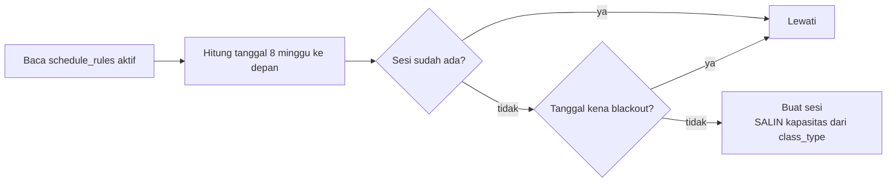

Kapasitas **disalin**, bukan di-join. Kalau nanti owner mengubah kapasitas jenis kelas,
sesi yang sudah punya booking tidak ikut berubah.

Satu-satunya dari empat job ini yang **tidak** terjadwal. Pemiliknya ingin tahu kapan
jadwalnya bertambah, bukan menemukannya sudah bertambah — jadi pemicunya tombol
"Terbitkan sekarang" di layar A7, dan `vercel.json` tidak memuat entri untuknya.
Endpoint-nya tetap hidup: klien yang ingin kembali ke otomatis cukup menambah satu
baris crontab.

Idempotensinya justru jadi lebih penting, bukan kurang: tombol bisa ditekan dua kali
karena halamannya lambat. Yang menjaganya index `sessions_rule_mulai_key`, sama seperti
saat ia masih cron. Menurunkan jangka terbit tidak menghapus sesi yang terlanjur terbit
di luar jangka baru — sebagian mungkin sudah ada pesertanya.

**Penjaganya ada di hulu, bukan di sini.** Job ini menerbitkan apa pun yang tertulis di
`schedule_rules`; ia tidak bertanya apakah dua slot saling menabrak. Yang bertanya
`slotBentrok()` (BR-7.6) saat slotnya dibuat di A7. Alasannya: jadwal ini di-assign
berdasarkan **jenis kelas**, bukan alat — `schedule_rules` tidak mengenal ruang maupun
mesin — jadi dua slot Reformer di jam yang sama akan menjual 8 + 8 kursi untuk 8
reformer, dan yang menemukannya delapan orang yang sudah datang. Menolaknya saat
booking berarti menghukum member atas kesalahan studio.

### 7.4 Tutup waitlist — tiap jam · `UC-S04`

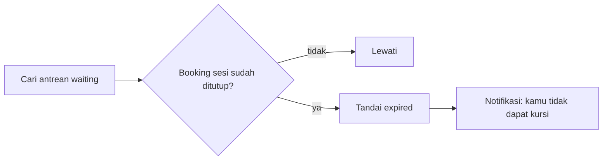

---

## 8. Beli paket dan bayar — `UC-M11` ⬜ hanya versi real

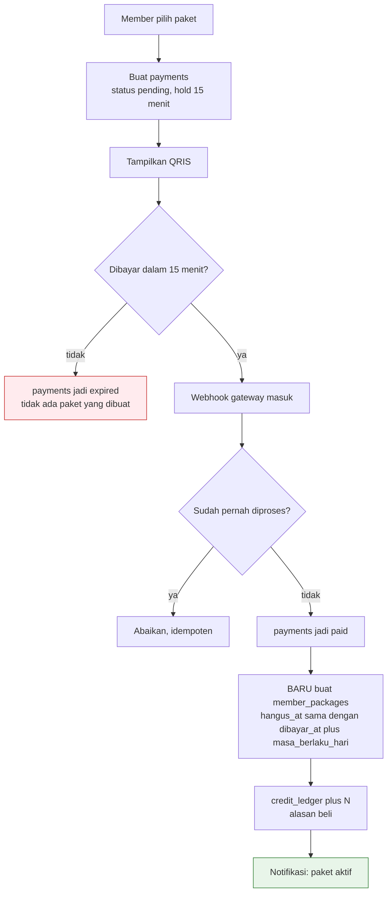

**Aturan:** BR-1.3, BR-8.1 → BR-8.3

Pengecekan H wajib. Gateway pembayaran **sering mengirim webhook lebih dari sekali** —
tanpa pengecekan ini, member bisa dapat kredit dobel.

Di demo, seluruh alur ini diganti satu tombol "Simulasi Bayar Berhasil" yang
langsung menjalankan kotak K dan L.

---

## 9. Ringkasan titik rawan

| # | Titik | Risiko kalau salah | Ada di | Dijaga oleh |
|---|---|---|---|---|
| 1 | INSERT booking atomik | Double booking di depan owner | Alur 1, 4 | **database** — partial unique index, `src/db/kapasitas.test.ts` |
| 2 | Urutan pakai kredit paling cepat hangus | Member dirugikan, protes | Alur 2 | `pilihPaket()` |
| 3 | Kredit kembali ke paket ASAL | Masa berlaku bisa diakali | Alur 3 | `hasilPembatalan()` → `ke_paket` |
| 4 | Batal telat tidak menulis ledger baru | Kredit terpotong dua kali | Alur 3 | `hasilPembatalan()` → `kredit_kembali: false` |
| 5 | Loop lewati kredit tidak valid | Kursi kosong padahal antrean panjang | Alur 4 | `naikkanWaitlist()` → `dilewati[]` |
| 6 | `dipromosikan_at` diisi | Orang yang baru naik ikut kena aturan hangus | Alur 4 | `naikkanWaitlist()` → `naik.dipromosikan_at` |
| 7 | Job idempoten | Kredit hangus dua kali | Alur 7.2 | `hasilPenghangusan()` → `sudah_dihanguskan` |
| 8 | Webhook idempoten | Kredit dobel | Alur 8 | `bolehTerimaPembayaran()` → status `paid` |

Delapan titik ini yang wajib punya test. Sisanya boleh mengandalkan pemakaian manual.

Titik 1 dijaga database; tujuh sisanya keputusan murni di `src/rules/index.ts` dan diuji
di `src/rules/index.test.ts` tanpa database. Tiap test dibuktikan tidak sia-sia lewat
mutasi: aturannya sengaja dirusak, dan hanya test yang bersangkutan yang merah.
