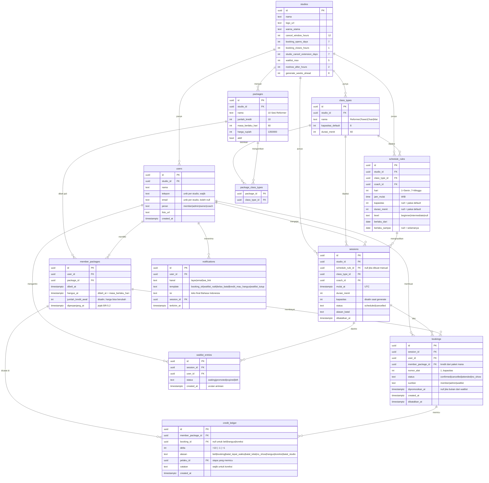
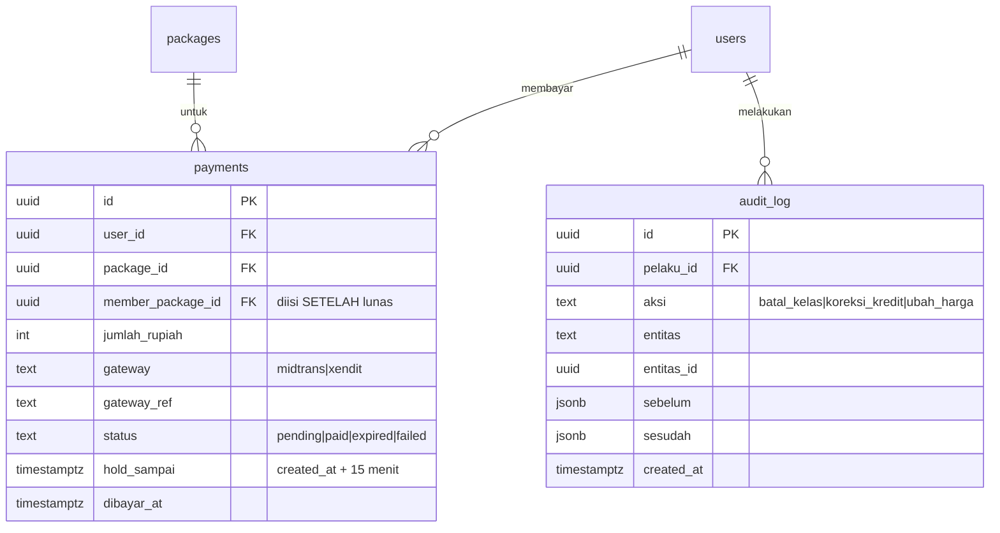

# Model Data — Sistem Booking Studio Pilates

> **Status:** Diterapkan di `src/db/schema.ts` · **Terakhir diperbarui:** 2026-09-22
> Pendamping [02-rules.md](02-rules.md), [03-use-cases.md](03-use-cases.md), [04-flows.md](04-flows.md). Setiap tabel merujuk aturan `BR-x.y` yang dilayaninya.
> Target: PostgreSQL. **12 tabel inti** + 2 tabel tambahan khusus versi real.

---

## 1. Tiga prinsip yang tidak bisa ditawar

Ada di [../AGENTS.md](../AGENTS.md) — tidak ada kolom saldo (BR-1.7), kapasitas dijaga
unique index (BR-2.3), waktu disimpan UTC (BR-7.5). Bagian 4 dan 5 di bawah adalah
penerapannya.

---

## 2. ERD inti



### Tambahan khusus versi real



---

## 3. Tabel per tabel

| Tabel | Peran | Aturan yang dilayani |
|---|---|---|
| `studios` | Identitas + **semua setelan** sebagai kolom biasa | 02-rules.md bagian 3 · BR-5.2 |
| `users` | Member, admin, owner, coach — satu tabel, dibedakan `peran` | BR-9 |
| `class_types` | Template kelas + kapasitas & durasi default | BR-7.2 |
| `schedule_rules` | Pola jadwal mingguan. **Bukan** sesi nyata | BR-7.1 |
| `sessions` | Instance nyata yang dibooking. Kapasitas **disalin** saat generate | BR-7.1, BR-7.2, BR-5 |
| `packages` | Katalog produk: jumlah kredit, masa berlaku, harga | BR-1.2, BR-8.3 |
| `package_class_types` | Jenis kelas yang boleh diikuti paket ini | **BR-1.4** |
| `member_packages` | Paket yang sudah dibeli seseorang. **Kredit melekat di sini** | BR-1.2, BR-1.3, BR-3.1 |
| `credit_ledger` | Buku besar. Satu-satunya sumber kebenaran sisa kredit | **BR-1.7** |
| `bookings` | Kursi yang dipesan, lengkap dengan nomor alat | BR-2, BR-3, BR-6 |
| `waitlist_entries` | Antrean sesi penuh, urut `created_at` | BR-4 |
| `notifications` | Demo: isi panel "Pesan Terkirim". Real: jejak email + antrean tombol kirim-WA | BR-4.3, BR-5.3 |
| `payments` *(real)* | Pembayaran + hold 15 menit | BR-8.1, BR-8.2 |
| `audit_log` *(real)* | Jejak aksi admin/owner | BR-9.5 |

### Catatan penting per tabel

- **`sessions.kapasitas` disalin**, tidak di-join ke `class_types`. Kalau nanti kapasitas
  jenis kelas berubah, sesi yang sudah ada booking tidak ikut berubah. (BR-7.3)
- **`member_packages.jumlah_kredit_awal` juga disalin** dari `packages`. Harga dan isi
  paket boleh berubah kapan saja tanpa merusak riwayat pembelian lama.
- **`bookings.member_package_id` wajib diisi.** Ini yang membuat BR-3.1 mungkin —
  saat batal tepat waktu, kredit kembali ke **paket asalnya**, bukan jadi kredit baru.
- **`waitlist_entries` tidak punya kolom posisi.** Urutan = `ORDER BY created_at`.
  Kolom posisi harus di-renumber tiap ada yang keluar; `created_at` tidak pernah salah.
- **`bookings.status` tidak pernah dihapus.** `cancelled` tetap tersimpan sebagai riwayat.
- **`users.telepon` wajib, `users.email` boleh kosong.** Studio menghubungi member
  lewat WhatsApp; belum tentu tiap member punya email aktif (02-rules.md bagian 8,
  pertanyaan terbuka 6). Magic link hanya tersedia bagi yang mengisi email — sisanya
  dibukakan link login oleh admin (06-architecture.md bagian 6).
- **Penjaga kapasitas menyalip penjaga duplikat.** Di sesi yang sudah penuh, query 5.1
  mengembalikan 0 baris sebelum index `(session_id, user_id)` sempat tersentuh. Dua
  invarian itu harus diuji di sesi yang berbeda — lihat `src/db/kapasitas.test.ts`.

---

## 4. Constraint & index wajib

```sql
-- BR-2.3 kapasitas keras: dua orang menyerbu alat terakhir, satu pasti gagal
CREATE UNIQUE INDEX ON bookings (session_id, nomor_alat) WHERE status = 'confirmed';

-- BR-2.4 satu member maks satu kursi per sesi
CREATE UNIQUE INDEX ON bookings (session_id, user_id) WHERE status = 'confirmed';

-- BR-4.1 tidak bisa antre dua kali di sesi yang sama
CREATE UNIQUE INDEX ON waitlist_entries (session_id, user_id) WHERE status = 'waiting';

-- BR-1.6 satu paket hanya bisa dihanguskan sekali, walau cron jalan dua kali
CREATE UNIQUE INDEX ON credit_ledger (member_package_id) WHERE alasan = 'hangus';

-- BR-7.1 job generate sesi boleh diulang; NULL (sesi manual) tidak terjaring
CREATE UNIQUE INDEX ON sessions (schedule_rule_id, mulai_at)
  WHERE schedule_rule_id IS NOT NULL;

-- Nama jenis kelas tampil apa adanya di kartu paket, di saringan jadwal, dan
-- di pilihan A7. Dua "Reformer" membuat ketiganya menyebut hal yang tidak bisa
-- dibedakan pembacanya.
CREATE UNIQUE INDEX ON class_types (studio_id, nama);

CHECK (bookings.nomor_alat >= 1);
CHECK (credit_ledger.delta <> 0);
CHECK (member_packages.hangus_at > member_packages.dibeli_at);
```

Index pendukung (bukan invarian, hanya kecepatan):

```sql
CREATE UNIQUE INDEX ON users (studio_id, telepon);
CREATE UNIQUE INDEX ON users (studio_id, email);   -- magic link mencari lewat email
CREATE INDEX ON sessions (studio_id, mulai_at);
CREATE INDEX ON credit_ledger (member_package_id);
CREATE INDEX ON member_packages (user_id, hangus_at);
```

---

## 5. Empat query yang menentukan sistem ini

### 5.1 Booking atomik — mustahil melebihi kapasitas (BR-2.3, BR-2.6)

```sql
INSERT INTO bookings (session_id, user_id, member_package_id, nomor_alat, status, sumber)
SELECT s.id, $user, $pkg, alat, 'confirmed', 'member'
FROM sessions s
CROSS JOIN LATERAL generate_series(1, s.kapasitas) AS alat
WHERE s.id = $session
  AND s.status = 'scheduled'
  AND alat NOT IN (
    SELECT nomor_alat FROM bookings
    WHERE session_id = s.id AND status = 'confirmed'
  )
ORDER BY (alat = $pilihan) DESC, alat
LIMIT 1;
-- 0 baris terinsert = kelas penuh, arahkan ke waitlist.
```

Nomor alat **diturunkan dari kapasitas sesi**, jadi tidak mungkin di luar rentang.
Unique index menangani balapan. Tidak perlu lock, tidak perlu transaksi rumit.
Potong kredit (`credit_ledger` −1) di transaksi yang sama.

`$pilihan` adalah alat yang diminta member di layar M2 (BR-2.6). Ia hanya menggeser
**urutan**, bukan menambah syarat: kalau alatnya keburu terisi, klausa `NOT IN` yang
sama tetap memberi alat kosong terkecil. Menjadikannya syarat — `AND alat = $pilihan` —
berarti booking bisa gagal padahal kursi masih ada. `NULL` (waitlist, jalur admin, dan
member yang tidak memilih) membuat perbandingannya `NULL` untuk semua baris, jadi
urutannya kembali persis seperti sebelum kolom ini ada.

### 5.2 Sisa kredit + paket mana yang dipakai (BR-1.5, BR-1.7)

```sql
SELECT mp.id, mp.hangus_at, COALESCE(SUM(cl.delta), 0) AS sisa
FROM member_packages mp
LEFT JOIN credit_ledger cl ON cl.member_package_id = mp.id
WHERE mp.user_id = $user
  AND mp.hangus_at > now()
GROUP BY mp.id, mp.hangus_at
HAVING COALESCE(SUM(cl.delta), 0) > 0
ORDER BY mp.hangus_at;   -- BR-1.5: paling cepat hangus dipakai duluan
-- Tambah filter BR-1.4: paket harus mengizinkan class_type sesi yang dituju.
```

### 5.3 Panel "kredit hangus ≤ 7 hari" — layar A1 (senjata presentasi)

```sql
SELECT u.nama, u.telepon, mp.hangus_at, SUM(cl.delta) AS sisa
FROM member_packages mp
JOIN users u ON u.id = mp.user_id
JOIN credit_ledger cl ON cl.member_package_id = mp.id
WHERE mp.hangus_at BETWEEN now() AND now() + interval '7 days'
GROUP BY u.id, mp.id
HAVING SUM(cl.delta) > 0
ORDER BY mp.hangus_at;
```

### 5.4 Naikkan waitlist saat ada kursi kosong (BR-4.3, BR-4.4)

```
1. Ambil waitlist_entries status='waiting' ORDER BY created_at, satu per satu
2. Cek kredit valid pakai query 5.2 → tidak ada? tandai 'expired', lanjut berikutnya (BR-4.4)
3. Jalankan query 5.1 → berhasil? tandai 'promoted',
   isi bookings.dipromosikan_at, sumber='waitlist'
4. Tulis notifications
```

`dipromosikan_at` yang membuat BR-3.5 bisa dihitung: kalau selisihnya dengan
`sessions.mulai_at` di bawah `cancel_window_hours`, member itu bebas batal tanpa hangus.

---

## 6. Job terjadwal

| Job | Frekuensi | Aturan | Isi |
|---|---|---|---|
| Terbitkan sesi | **Tombol di A7** | BR-7.1 | Buat sesi dari `schedule_rules` sampai `generate_weeks_ahead` minggu ke depan |
| Hanguskan kredit | Harian | BR-1.6 | Paket lewat `hangus_at` dengan sisa > 0 → tulis ledger `−sisa`, alasan `hangus` |
| No-show otomatis | Tiap jam | BR-6.2 | Booking `confirmed` yang kelasnya selesai > 2 jam lalu → `no_show` |
| Tutup waitlist | Tiap jam | BR-4.6 | Antrean di sesi yang booking-nya sudah ditutup → `expired` + notifikasi |
| Pengingat kredit | Harian | — | Notifikasi ke member dengan kredit hangus ≤ 3 hari |

Keempat job pertama jadi **endpoint HTTP biasa** di `src/app/api/cron/`, dijaga
header `Authorization: Bearer $CRON_SECRET`. Vercel Cron memanggilnya di demo
(`vercel.json`), `crontab` + `curl` di VPS — kode sama, beda satu berkas config
(06-architecture.md keputusan 8). **Kecuali "Terbitkan sesi":** endpoint-nya ada tapi
tidak dijadwalkan, karena pemicunya tombol di A7 (Alur 7.3). Logikanya sendiri ada di `src/db/job.ts` sebagai
fungsi yang menerima klien database, jadi bisa diuji tanpa server.

`notifications.terkirim_at` berdefault `now()`: kanal `layar` sampai ke penerimanya
begitu barisnya ditulis, dan layar A8 mengurutkan dari sana. Saat email sungguhan
dibangun, jalur itu harus mengirim NULL eksplisit — "terkirim" untuk email berarti SMTP
sudah menerimanya, bukan barisnya ada.

Semua job **idempoten** — aman dijalankan ulang, dan itu bukan kemewahan: cron
di-retry setelah timeout, telat, atau tumpang tindih dengan jalannya sendiri.

Tiga job pertama idempoten karena filter statusnya: baris yang sudah diproses
berhenti cocok. "Hanguskan kredit" tidak bisa begitu — ia menulis baris baru — jadi
penjaganya `credit_ledger_hangus_key` di bagian 4. Pola "cek dulu baru tulis" bocor
di sini persis seperti pada kapasitas: dua jalan yang tumpang tindih membaca "belum"
bersamaan, lalu dua-duanya menulis.

---

## 7. Yang sengaja TIDAK dibuat

| Tidak ada | Alasan | Tambahkan kalau |
|---|---|---|
| Tabel `rooms` / `equipment` | Jadwal di-assign per **jenis kelas**, bukan per alat. Nomor alat cukup jadi integer `1..kapasitas` di `bookings` — ia nomor kursi di dalam satu sesi, bukan identitas mesin. Risiko yang ditinggalkannya (dua kelas Reformer serentak menjual 16 kursi untuk 8 reformer) ditutup BR-7.6 di hulu, saat slotnya dibuat | Studio punya alat dengan identitas sendiri: jadwal servis, kode aset, atau ruang yang bisa dipesan terpisah dari kelasnya |
| Kolom `class_types.warna` | Ada di skema pertama, tidak pernah dipakai satu layar pun — kalender mewarnai per **status** (`ok` · `neutral` · `muted`), bukan per jenis kelas, dan DS-14 melarang warna jadi penanda tunggal. Dibuang di migrasi 0004 | Jenis kelas perlu penanda visual yang lolos kontras DAN tetap punya pasangan teks |
| Tabel `coaches` terpisah | Coach adalah `users` dengan `peran='coach'` | Butuh data khusus coach: sertifikasi, tarif, komisi |
| Kolom saldo kredit | Jumlahkan `credit_ledger` — selalu benar, tidak bisa melenceng | Terbukti lambat di atas ~100rb baris ledger; baru buat materialized view |
| Kolom status di `member_packages` | Bisa diturunkan dari `hangus_at` + jumlah ledger | Query jadi berat |
| Kolom posisi di `waitlist_entries` | `ORDER BY created_at` tidak pernah perlu di-renumber | Owner minta bisa menggeser urutan manual |
| Soft delete di mana pun | Pakai kolom `status`; tidak ada baris yang benar-benar dihapus | — |
| Cek bentrok jam member di level DB (BR-2.5) | Cukup dicek di aplikasi — ini bukan invarian uang/kapasitas | Terbukti bocor di produksi; pakai exclusion constraint `btree_gist` |
| Multi-cabang penuh | `studio_id` ada di 5 tabel akar: `users`, `class_types`, `schedule_rules`, `sessions`, `packages`. Tabel transaksi menjangkaunya lewat join | Klien kedua punya lebih dari satu lokasi — baru tambahkan `studio_id` ke tabel transaksi kalau query join terbukti berat |

---

## 8. Belum ada tabelnya

**Sesi login.** AGENTS.md menyebut "session token di tabel + cookie httpOnly", tapi
12 tabel inti tidak memuatnya — demo memalsukan login lewat tombol "Masuk sebagai…"
(bagian 9). Tabel ke-13 `auth_sessions` baru dibuat saat magic link sungguhan
dibangun. Namanya **tidak boleh** `sessions` — itu sudah dipakai sesi kelas.

---

## 9. Cakupan demo

Dibangun untuk demo: **12 tabel inti** (semua kecuali `payments` dan `audit_log`).

Yang dipalsukan tanpa tabel baru:
- **Login** → pilih baris `users` langsung, tanpa password
- **Pembayaran** → tombol simulasi langsung membuat `member_packages` + ledger `+N`
- **Email** → tulis ke `notifications` dengan `kanal='layar'`, tampilkan di panel admin
- **Reset demo** → `TRUNCATE` semua tabel lalu jalankan ulang seed
- **Reset jadwal** → hapus `sessions`, `bookings`, `waitlist_entries`,
  `notifications`, dan baris `credit_ledger` yang menunjuk sebuah booking.
  Tidak disentuh: `studios`, `users`, `class_types`, `packages`,
  `package_class_types`, `schedule_rules`, `member_packages`. Kredit kembali
  seperti saat dibeli tanpa menyetel apa pun — BR-1.7 menghitung sisa dari
  SUM(delta), jadi menghapus potongannya sudah mengembalikannya

Seed wajib membuat tanggal **relatif terhadap `now()`** — lihat 02-rules.md bagian 6.2.
